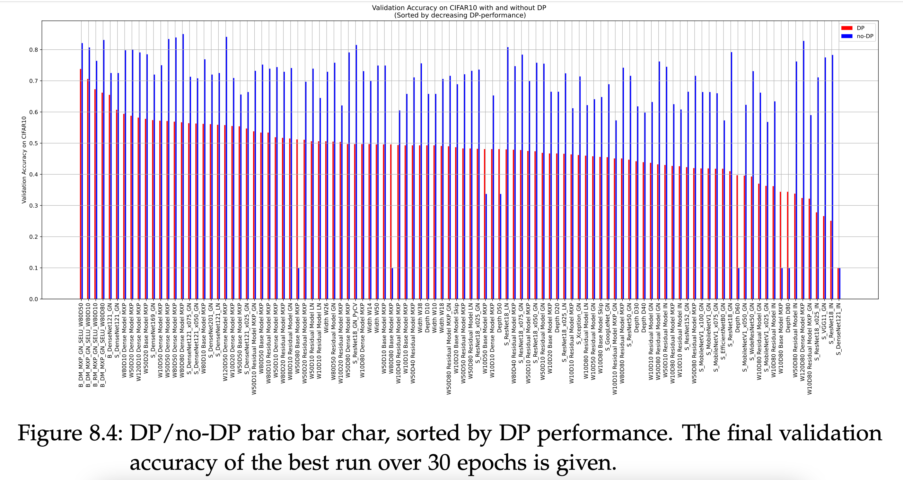

# SmoothNet
This is the codebase for the paper [SmoothNets: Optimizing CNN architecture design for differentially private deep learning](https://arxiv.org/abs/2205.04095) which was accepted at the TPDP Workshop at ICML 2022. See a clean and more optimized version of the SmoothNets v1 in the [TUM-AIMED/PrivateModelArchitectures](https://github.com/TUM-AIMED/PrivateModelArchitectures) repo under [SmoothNet](https://github.com/TUM-AIMED/PrivateModelArchitectures/blob/master/PrivateModelArchitectures/Classification/SmoothNet.py).

# Experiments 

In total, we **evaluated over 100 different model architectures in more than 6000 experiments on CIFAR-10 and ImageNette** based on (a) handcrafted models, intended to inspect the effect of isolated model components and (b) on established (SOTA) models to guarantee representative results.
* Following multiple requests, see all the results of the study with all detailed parameters and performance values in the [results section and the appendix of my thesis](https://drive.google.com/drive/folders/1aqgswca16C5CRg0rjk3tIT7NW5M_Dw1k?usp=sharing).
* See under `/experiments` for more information about the experiments.

# DPBenchmark Codebase
This is the codebase of the ongoing research project on the benchmarking of different popular machine learning design choices in differentially private learning systems. This work mainly focuses on Image Classification and Segmentation on standard image datasets and medical datasets. Main tools used are Opacus, PyTorch Lightning and Weights&Biases.

Three important files: 
* `trainer_lean.py` - the main training file parsing the configurations, communicating with wandb if wanted, using opacus if wanted. In the `old_opacus_codebase` branch an earlier implementation based on a earlier version of opacus (and deepee) was well as integration with PyTorch Lightning can be found. 
* `lean/data.py` - for now adapted model classes for CIFAR10, ImageNette.
* `lean/models.py` - custom models, and model generators. 
* `lean/utils.py` - custom utility functions. 
* `lean/config.yaml` - to select the models, data, optimization, DP params.

# Installation 
1. Create conda env with `conda env create -f setup/environment-yaml`
2. Download necessary data sources 
    * Or create symlink to shared data-folder with `ln -s /path/to/shared/data data`
3. Login to weights and biases
    * Login to wandb: `wandb login`
    * Start/Stop sync: `wandb online`/`wandb offline`
4. *Optional: Change Opacus BatchNorm Layers*
    * For example in *opacus/validators/batch_norm.py*: `nn.GroupNorm(math.gcd(32, module.num_features), module.num_features, affine=module.affine)`to `nn.GroupNorm(math.gcd(8, module.num_features), module.num_features, affine=module.affine)`.

# Usage
1. Configure `configs.yaml` 
2. Run `python trainer_lean.py` (if using wandb don't forget `wandb online`)
3. It is compatible with sweeps over the L2-clip and number of epochs using the sweep functionality of weights&biases, which runs `python trainer_lean.py --L2_clip=1.0 --max_epochs=90` in the background. 
    * Under `sweeps/dp_params_sweep.yaml` the main sweep params are defined
